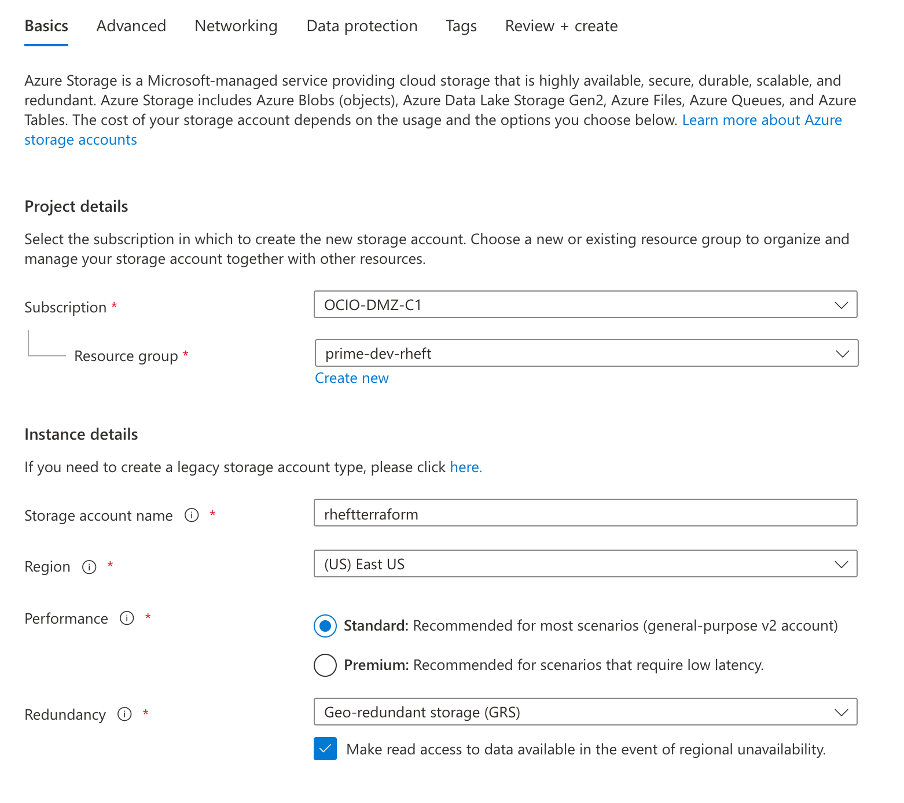
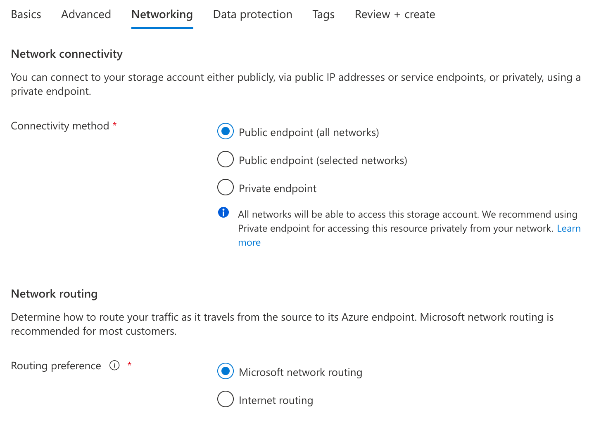

# PRIME ReportStream Operations

PRIME ReportStream uses Terraform to manage our Azure development environment. All Azure configuration should be done through Terraform to ensure consistency between environments.

To ensure our Terraform state is managed with consistent Terraform versions, we are running Terraform through a Docker image. Terraform should not be used outside of this Docker image to ensure the Terraform core, plugins, and other versions all remain identical.


## Connect to the VPN

All infrastructure operations must be done behind the environment-specific VPN. You can find [directions for configuring your VPN client in prime-router/docs/VPN.md](https://github.com/CDCgov/prime-data-hub/blob/master/prime-router/docs/vpn.md).


## Run Terraform interactively

Ensure you have the intended git branch checked out and navigate to the `./operations` directory in your CLI. For production deploys, always deploy from the `master` branch.

Our Terraform modules are broken out into four stages, each with the dependencies on the previous stages. Each stage can be accessed with an interactive terminal via the following commands:

```shell
make TF_ENV={dev,test,staging,prod} tf-01-network
make TF_ENV={dev,test,staging,prod} tf-02-config
make TF_ENV={dev,test,staging,prod} tf-03-persistent
make TF_ENV={dev,test,staging,prod} tf-04-app
```

If `TF_ENV` is omitted, `TF_ENV=dev` will be assumed.

## Login to Azure CLI (on first run and after token expiration)

```
az login
```

- Navigate to the provided login URL and input the provided token

This only needs to be on first run and after your Azure credentials expire. The state of your login will be persisted in a Docker volume that is shared across stages.


## Using Terraform

A typical Terraform deployment may look as follows:

```shell
make TF_ENV={dev,test,staging,prod} tf-01-network
tf plan -out plan.out
tf apply plan.out
exit

make TF_ENV={dev,test,staging,prod} tf-02-config
tf plan -out plan.out
tf apply plan.out
exit

make TF_ENV={dev,test,staging,prod} tf-03-persistent
tf plan -out plan.out
tf apply plan.out
exit

make TF_ENV={dev,test,staging,prod} tf-04-app
tf plan -out plan.out
tf apply plan.out
exit
```

This will deploy all the various stages, giving the opportunity to review the changes after each `plan`.

A few helpful things to note about our Terraform Docker container:
* We have a custom `tf` script that runs Terraform commands.
* Our `tf` script handles the `terraform init`, setting the correct resource group for Azure, and applying environment-specific configurations.
* You should not use the `terraform` command directly.

### Caveats

The Azure Terraform module has several known quirks that result in unexpected additions to the Terraform plan:

* Postgres Server Key (`module.database.azurerm_postgresql_server_key.postgres_server_key[0]`)
  * Our Postgres encryption key is managed by the CDC
  * Whenever the CDC rotates the key, Terraform thinks a change needs to be applied
  * No change is actually applied when Terraform applies the plan, so there is no harm in accepting this change
* Function App configuration (`module.prime_data_hub.module.function_app.azurerm_function_app.function_app`)
  * The Function App is not run on a private endpoint, since the Front Door does not support private endpoints at this time
  * Due to this, we are manually whitelisting developer IPs in the firewall configuration
  * Terraform will suggest removing or adding IPs to the configuration
  * There is no harm in accepting Terraform's suggested changes, but developers will have to re-add their IP to the firewall the next time they access the Function App


# Deploying a new environment

* Environments must have a unique resource group.
* Resources groups are managed by the CDC.
* Contact the IAM team at <adhelpdsk@cdc.gov> to get your resource group created.

## Create the Terraform storage account

1. Login to your Azure console.
2. In the intended resource group, create a storage account named: `{prefix}terraform`
    * Note: Storage account names do not allow punctuation
3. Follow the screenshots and replicate the settings







## Create the Terraform storage container

In your newly created storage account, create a container named: `terraformstate`


## Create your Terraform configuration

1. In the `app/src/environments/configuration` folder, create `{env}.tfvars` and `{env}.tfbackend` files
2. The `{env}.tfvars` contains all the environment-specific variables
    * You can base this off an existing environment, if necessary
3. The `{env}.tfbackend` contains the location where Terraform will store your state
    * You can base this off an existing environment and populate with the storage account created above

## Deploy the environment

Our Terraform modules are broken out into four stages, each with the dependencies on the previous layers:

* `01-network`
    * Contains the core network infrastructure
    * VNET, subnets, VPN Gateway, etc.
* `02-config`
    * Contain the infrastructure required for configuring the environment
    * Key Vaults, App Service Plan, etc.
    * After deploying this layer, manual configuration is required
    * This layer is dependent on the network infrastructure being deployed
* `03-persistent`
    * Contains the data storage infrastructure for the application
    * Database, Storage Account
    * This layer is dependent on the configuration infrastructure being deployed and secrets populated
* `04-app`
    * Contain the application servers and related infrastructure
    * Function App, Front Door, Application Insights, etc.
    * The layer is dependent on the persistent layer being deployed
    
To deploy the full state follow the deployment directions at the top of this document in the following order:

1. Deploy `01-network`
2. Create a VPN profile
    * [See PR #638 for directions on standing up a VPN](https://github.com/CDCgov/prime-data-hub/pull/638)
3. Connect to the VPN
    * [Directions for configuring your VPN client in prime-router/docs/VPN.md](https://github.com/CDCgov/prime-data-hub/blob/master/prime-router/docs/vpn.md)
4. Deploy `02-config`
5. Populate the following secrets in the Key Vaults:
   * `{env}-appconfig`:
     * `functionapp-postgres-user`
     * `functionapp-postgres-pass`
   * `{env}-keyvault`:
       * `hhsprotect-ip-ingress`
       * `pagerduty-integration-url`
6. Deploy `03-persistent`
7. Deploy `04-app`

# Tear down a environment

Destroy the Terraform stages in reverse stage order:

```shell
make TF_ENV={dev,test,staging,prod} tf-04-app
tf destroy
exit

make TF_ENV={dev,test,staging,prod} tf-03-persistent
tf destroy
exit

make TF_ENV={dev,test,staging,prod} tf-02-config
tf destroy
exit

make TF_ENV={dev,test,staging,prod} tf-01-network
tf destroy
exit
```
